# soruGir.js

Bal Peteği soru gir ekranı kayıtları.

## soruGir.js yapısı

[](https://mermaid-js.github.io/mermaid-live-editor/#/edit/eyJjb2RlIjoiZ3JhcGggVERcbiAgQSgoQkHFnkxBKSktLT5CW2Rva8O8bWFuIHnDvGtsZW5kacSfaW5kZV1cbiAgQiAtLT4gQ3tvdHVydW0ga29udHJvbMO8IHlhcH1cbiAgQyAtLT58MHwgRFtnaXJpxZ8geWFwIGVrcmFuYSB5w7ZubGVuZGlyXVxuICBDIC0tPnwxfCBFW2t1bGxhbsSxY8SxIHZlcmlsZXJpbmkgw6dla11cbiAgRS0tPkZbw7xzdCBtZW7DvCBpw6dlcmnEn2kgecO8a2xlXVxuICBGLS0-R1tzb3J1IGdpciBla3JhbsSxIGnDp2VyacSfaSB5w7xrbGVdXG4gIEctLT5IKChEVVIpKVxuICBELS0-SCIsIm1lcm1haWQiOnsidGhlbWUiOiJiYXNlIiwidGhlbWVWYXJpYWJsZXMiOnsiYmFja2dyb3VuZCI6IiNmNGY0ZjQiLCJkYXJrTW9kZSI6ZmFsc2UsInByaW1hcnlDb2xvciI6IiNmZmY0ZGQiLCJub3RlQmtnQ29sb3IiOiIjZmZmNWFkIiwibm90ZVRleHRDb2xvciI6IiMzMzMiLCJmb250RmFtaWx5IjoiXCJ0cmVidWNoZXQgbXNcIiwgdmVyZGFuYSwgYXJpYWwiLCJmb250U2l6ZSI6IjE2cHgiLCJwcmltYXJ5VGV4dENvbG9yIjoiIzMzMyIsInNlY29uZGFyeUNvbG9yIjoiaHNsKC03OS40MTE3NjQ3MDU5LCAxMDAlLCA5My4zMzMzMzMzMzMzJSkiLCJ0ZXJ0aWFyeUNvbG9yIjoiaHNsKDIyMC41ODgyMzUyOTQxLCAxMDAlLCA5OC4zMzMzMzMzMzMzJSkiLCJwcmltYXJ5Qm9yZGVyQ29sb3IiOiJoc2woNDAuNTg4MjM1Mjk0MSwgNjAlLCA4My4zMzMzMzMzMzMzJSkiLCJzZWNvbmRhcnlCb3JkZXJDb2xvciI6ImhzbCgtNzkuNDExNzY0NzA1OSwgNjAlLCA4My4zMzMzMzMzMzMzJSkiLCJ0ZXJ0aWFyeUJvcmRlckNvbG9yIjoiaHNsKDIyMC41ODgyMzUyOTQxLCA2MCUsIDg4LjMzMzMzMzMzMzMlKSIsIm5vdGVCb3JkZXJDb2xvciI6ImhzbCg1Mi42ODI5MjY4MjkzLCA2MCUsIDczLjkyMTU2ODYyNzUlKSIsInNlY29uZGFyeVRleHRDb2xvciI6InJnYigxNy4wMDAwMDAwMDAxLCAxNy4wMDAwMDAwMDAxLCAxNy4wMDAwMDAwMDAxKSIsInRlcnRpYXJ5VGV4dENvbG9yIjoicmdiKDQuMjUwMDAwMDAwMSwgNC4yNTAwMDAwMDAxLCA0LjI1MDAwMDAwMDEpIiwibGluZUNvbG9yIjoiIzBiMGIwYiIsInRleHRDb2xvciI6IiMzMzMiLCJub2RlQmtnIjoiI2ZmZjRkZCIsIm1haW5Ca2ciOiIjZmZmNGRkIiwibm9kZUJvcmRlciI6ImhzbCg0MC41ODgyMzUyOTQxLCA2MCUsIDgzLjMzMzMzMzMzMzMlKSIsImNsdXN0ZXJCa2ciOiJoc2woMjIwLjU4ODIzNTI5NDEsIDEwMCUsIDk4LjMzMzMzMzMzMzMlKSIsImNsdXN0ZXJCb3JkZXIiOiJoc2woMjIwLjU4ODIzNTI5NDEsIDYwJSwgODguMzMzMzMzMzMzMyUpIiwiZGVmYXVsdExpbmtDb2xvciI6IiMwYjBiMGIiLCJ0aXRsZUNvbG9yIjoicmdiKDQuMjUwMDAwMDAwMSwgNC4yNTAwMDAwMDAxLCA0LjI1MDAwMDAwMDEpIiwiZWRnZUxhYmVsQmFja2dyb3VuZCI6ImhzbCgtNzkuNDExNzY0NzA1OSwgMTAwJSwgOTMuMzMzMzMzMzMzMyUpIiwibm9kZVRleHRDb2xvciI6IiMzMzMiLCJhY3RvckJvcmRlciI6ImhzbCg0MC41ODgyMzUyOTQxLCA2MCUsIDgzLjMzMzMzMzMzMzMlKSIsImFjdG9yQmtnIjoiI2ZmZjRkZCIsImFjdG9yVGV4dENvbG9yIjoiIzMzMyIsImFjdG9yTGluZUNvbG9yIjoiZ3JleSIsImxhYmVsQm94QmtnQ29sb3IiOiIjZmZmNGRkIiwic2lnbmFsQ29sb3IiOiIjMzMzIiwic2lnbmFsVGV4dENvbG9yIjoiIzMzMyIsImxhYmVsQm94Qm9yZGVyQ29sb3IiOiJoc2woNDAuNTg4MjM1Mjk0MSwgNjAlLCA4My4zMzMzMzMzMzMzJSkiLCJsYWJlbFRleHRDb2xvciI6IiMzMzMiLCJsb29wVGV4dENvbG9yIjoiIzMzMyIsImFjdGl2YXRpb25Cb3JkZXJDb2xvciI6ImhzbCgtNzkuNDExNzY0NzA1OSwgMTAwJSwgODMuMzMzMzMzMzMzMyUpIiwiYWN0aXZhdGlvbkJrZ0NvbG9yIjoiaHNsKC03OS40MTE3NjQ3MDU5LCAxMDAlLCA5My4zMzMzMzMzMzMzJSkiLCJzZXF1ZW5jZU51bWJlckNvbG9yIjoiI2Y0ZjRmNCIsInNlY3Rpb25Ca2dDb2xvciI6ImhzbCgyMjAuNTg4MjM1Mjk0MSwgMTAwJSwgOTguMzMzMzMzMzMzMyUpIiwiYWx0U2VjdGlvbkJrZ0NvbG9yIjoid2hpdGUiLCJzZWN0aW9uQmtnQ29sb3IyIjoiI2ZmZjRkZCIsInRhc2tCb3JkZXJDb2xvciI6ImhzbCg0MC41ODgyMzUyOTQxLCA2MCUsIDgzLjMzMzMzMzMzMzMlKSIsInRhc2tCa2dDb2xvciI6IiNmZmY0ZGQiLCJhY3RpdmVUYXNrQm9yZGVyQ29sb3IiOiIjZmZmNGRkIiwiYWN0aXZlVGFza0JrZ0NvbG9yIjoiaHNsKDQwLjU4ODIzNTI5NDEsIDEwMCUsIDEwMCUpIiwiZ3JpZENvbG9yIjoibGlnaHRncmV5IiwiZG9uZVRhc2tCa2dDb2xvciI6ImxpZ2h0Z3JleSIsImRvbmVUYXNrQm9yZGVyQ29sb3IiOiJncmV5IiwiY3JpdEJvcmRlckNvbG9yIjoiI2ZmODg4OCIsImNyaXRCa2dDb2xvciI6InJlZCIsInRvZGF5TGluZUNvbG9yIjoicmVkIiwidGFza1RleHRDb2xvciI6IiMzMzMiLCJ0YXNrVGV4dE91dHNpZGVDb2xvciI6IiMzMzMiLCJ0YXNrVGV4dExpZ2h0Q29sb3IiOiIjMzMzIiwidGFza1RleHREYXJrQ29sb3IiOiIjMzMzIiwidGFza1RleHRDbGlja2FibGVDb2xvciI6IiMwMDMxNjMiLCJsYWJlbENvbG9yIjoiIzMzMyIsImFsdEJhY2tncm91bmQiOiJoc2woMjIwLjU4ODIzNTI5NDEsIDEwMCUsIDk4LjMzMzMzMzMzMzMlKSIsImVycm9yQmtnQ29sb3IiOiJoc2woMjIwLjU4ODIzNTI5NDEsIDEwMCUsIDk4LjMzMzMzMzMzMzMlKSIsImVycm9yVGV4dENvbG9yIjoicmdiKDQuMjUwMDAwMDAwMSwgNC4yNTAwMDAwMDAxLCA0LjI1MDAwMDAwMDEpIiwiY2xhc3NUZXh0IjoiIzMzMyIsImZpbGxUeXBlMCI6IiNmZmY0ZGQiLCJmaWxsVHlwZTEiOiJoc2woLTc5LjQxMTc2NDcwNTksIDEwMCUsIDkzLjMzMzMzMzMzMzMlKSIsImZpbGxUeXBlMiI6ImhzbCgxMDQuNTg4MjM1Mjk0MSwgMTAwJSwgOTMuMzMzMzMzMzMzMyUpIiwiZmlsbFR5cGUzIjoiaHNsKC0xNS40MTE3NjQ3MDU5LCAxMDAlLCA5My4zMzMzMzMzMzMzJSkiLCJmaWxsVHlwZTQiOiJoc2woLTIzLjQxMTc2NDcwNTksIDEwMCUsIDkzLjMzMzMzMzMzMzMlKSIsImZpbGxUeXBlNSI6ImhzbCgtMTQzLjQxMTc2NDcwNTksIDEwMCUsIDkzLjMzMzMzMzMzMzMlKSIsImZpbGxUeXBlNiI6ImhzbCgxNjguNTg4MjM1Mjk0MSwgMTAwJSwgOTMuMzMzMzMzMzMzMyUpIiwiZmlsbFR5cGU3IjoiaHNsKDQ4LjU4ODIzNTI5NDEsIDEwMCUsIDkzLjMzMzMzMzMzMzMlKSJ9fSwidXBkYXRlRWRpdG9yIjpmYWxzZX0)

## sürüm notları

* 0.7.0. işlemler petek objesi üzerinden çağırıldı.
* 0.7.1. kod bloğunun üst kısmına geliştirici notu eklendi.